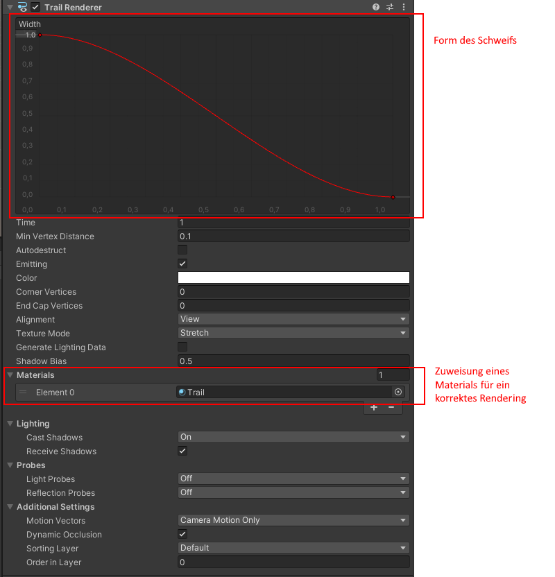

# Simple 3D Prototype

Beispielhafte Umsetzung eines Spiels in dem mehrere Bälle eingesammelt werden müssen als Einführung in die Unity Engine 
Leider hat die Aufnahme in der Übung nicht funktioniert, weswegen hier eine zusammengefasste Aufnahme nachträglich erstellt wurde.

Besprochene Elemente:

    Installation
    Projekterstellung
    Aufbau des Editors
    Rigidbody
    Script erstellen
    Collision
    Objekt Instantiation
    Canvas
    Scene Manager

In der Übung habe ich fälschlicherweise den LineRenderer, statt einen Trailrenderer hinzugefügt. Der Renderer-Fehler ergab sich aus der fehlenden Zuweisung eines Materials. Die korrekte Einstellung sieht wie folgt aus:

Aufnahmen zur Übung findet ihr im StudIP
